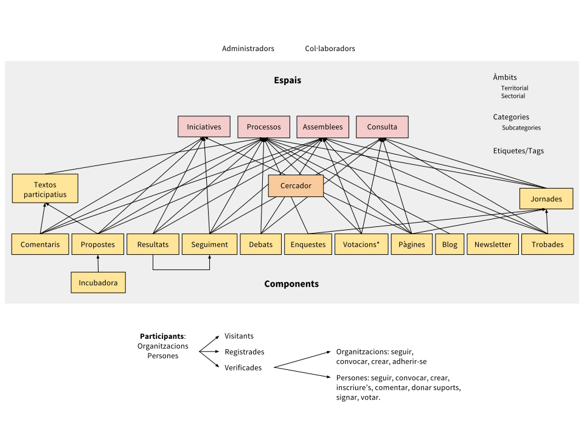

# 1. Descripció general i introducció al funcionament de Decidim

Decidim ([http://decidim.org](http://decidim.org)) és una infraestructura digital per a la democràcia participativa construïda enterament en programari lliure de manera col·laborativa. Més concretament, Decidim és un entorn web (un *framework*) fet a Ruby on Rails que permet crear i configurar un portal o plataforma web, a tall d'una xarxa social, per a la participació democràtica. El portal permet a qualsevol organització (un ajuntament, una associació, universitat, ONG, sindicat, barri o cooperativa) crear processos massius de planificació, de pressupostos participatius, de disseny col·laboratiu de reglaments, espais urbans o eleccions. També permet organitzar reunions presencials, convocar trobades, inscripcions, publicació d'actes, estructurar òrgans de governs o assemblees, convocar consultes o canalitzar iniciatives.

Per comprendre en detall el funcionament de Decidim, és necessari fer una diferenciació entre *espais* i *components* de participació (vegeu la Figura 1).

* **Espais de participació.** És el marc que defineix la forma en la qual la participació es durà a terme, els *canals* o mitjans pels quals la ciutadania o els membres d'una organització poden tramitar demandes o articular propostes i prendre decisions. Són espais de participació les *Iniciatives*, els *Processos*, les* Assemblees *i les* Consultes*. Exemples concrets de cada un d'ells són: una iniciativa ciutadana per canviar directament un reglament (*Iniciativa*), l'assemblea general o un consell de treballadors (*Assemblea*), uns pressupostos participatius, un procés electoral o un procés de planificació estratègica (*Processos*), un referèndum o una crida a votar Sí o No a una proposta concreta (*Consulta*).

* **Components de participació.** Són els *mecanismes* de participació que permeten la interacció entre les persones usuàries de la plataforma i cada un dels espais de participació. Els components de participació són: *trobades, jornades, incubadora, propostes, textos participatius, enquestes, debats, resultats, seguiment, votacions, pàgines, blog, comentaris, butlletí* i *cercador*.

Les persones usuàries de la plataforma (participants) interactuen a través dels mecanismes de participació anomenats *components*, que ofereixen funcionalitats específiques per a diferents *espais* de participació. Dit d'una altra manera, els *espais* de participació, com les *Iniciatives*, les *Assemblees*, els *Processos* o les *Consultes* disposen de components que es combinen entre si com a mecanismes de participació. Entre els components més destacats hi ha les *trobades presencials*, les *enquestes*, les *propostes*, les *votacions,* el *seguiment de resultats* i els *comentaris*. Així, per exemple, un procés de participació específic (com l'elaboració de pressupostos participatius) pot combinar, en les seves diferents fases, la possibilitat de convocar i registrar els resultats de trobades presencials amb la ciutadania, pot incloure una enquesta, també la possibilitat de fer propostes, després d'un període de comentaris i debats, activar el component de votació per decidir sobre els projectes un sistema de despesa del pressupost, activar una enquesta d'avaluació i finalment el component de seguiment de l'execució dels projectes escollits.

Figura 1:* Diagrama resumit de Decidim com a combinació de components en instàncies d'espais de participació. El component Votacions* permet diferents sistemes de vot, expressió de suport o adhesió a una proposta.*

L'espai de **Processos** permet crear, activar/desactivar i administrar diferents processos de participació, articular-los en diferents fases en què poden combinar-se tots els components. L'espai d’**Assemblees** ofereix la possibilitat de definir òrgans o grups que es reuneixen periòdicament, detallar-ne la composició, llistar i geolocalitzar les seves trobades i participar-hi (acudint-hi si l'aforament i la naturalesa de l'assemblea ho permet, introduint punts en l'ordre del dia o comentant les propostes i decisions preses per l’òrgan esmentat). L'espai d’**Iniciatives** permet crear iniciatives de manera col·laborativa, definir-ne la trajectòria o l’objectiu, recollir suports, debatre i difondre la iniciativa i definir punts de trobada per a la recollida de signatures presencial. L'espai de **Consultes** fa possible articular referèndums, generar debats, connectar amb un sistema de vot electrònic segur i mostrar els resultats.

En relació amb els components, el component **incubadora** de propostes facilita realitzar col·laborativament propostes i fer un seguiment i control dels canvis. El component **propostes** permet crear oficialment una proposta, geolocalitzar-la, adjuntar documents, així com navegar i filtrar propostes. El component **resultats** serveix per convertir propostes en resultats i donar respostes oficials a la seva acceptació o rebuig. El component **seguiment** ofereix la possibilitat de subdividir resultats en projectes, definir i aplicar estats de progrés en la seva execució i visualitzar el grau d'execució dels resultats. El component **enquestes** facilita dissenyar enquestes, publicar-les i visualitzar-ne i baixar-ne els resultats. El component **comentaris** permet realitzar comentaris niats, votar-los, respondre i notificar les respostes. El component **textos participatius** permet dividir un document de text en propostes o resultats i, inversament, compondre i visualitzar un text unificat partint d'una col·lecció de propostes o resultats. El component **votacions** ofereix la possibilitat d'activar diferents sistemes de vot sobre les propostes: vot directe il·limitat, limitat, ponderat, basat en costos, etcètera. El component **pàgines** serveix per crear pàgines informatives amb text enriquit, imatges i vídeos. El component **blog** permet crear, categoritzar i mostrar cronològicament notícies. El component **trobades presencials** ofereix la possibilitat de convocar, definir lloc i hora, realitzar la inscripció i el control d'assistència, definir l'estructura i els continguts d'una cita o trobada presencial, així com de publicar-ne les actes, les propostes o els resultats. El component **jornades** permet crear un web d'unes jornades unificant un conjunt de petites cites presencials (xerrades, tallers, etcètera), compondre un programa i gestionar-ne l'assistència. El component **newsletter** o butlletí serveix per enviar correus electrònics a totes les persones registrades en la plataforma o, de manera selectiva, a aquelles que participin en un espai determinat (NOTE:  No tots els components funcionals aquí descrits corresponen un a un amb components de l'arquitectura de Decidim. Per exemple, ara per ara no existeix el component de votacions com a tal, les votacions són una propietat del component propostes que s'activa o desactiva des del tauler d'administració. El mateix succeeix amb el component resultats i el component seguiment-de-resultats. Hem optat per realitzar una distinció funcional de component, ja que l'arquitectura de Decidim pot variar pel que fa a això en el transcurs dels propers mesos.).

Quant a les persones participants, existeixen tres categories diferents:

* **Persona visitant.** Pot veure: accedir a tot el contingut de la plataforma sense haver de registrar-se.

* **Persona registrada.** Pot contribuir: creant un nom de persona usuària, contrasenya i compte de correu electrònic (o de diferents xarxes socials). Pot realitzar comentaris, crear propostes, enviar missatges i seguir participants o elements de la plataforma i rebre notificacions.

* **Persona verificada**. Correspon a un nivell superior de participació. La persona pot acreditar-se com a membre d'una organització, ciutadana d'un municipi, o pertanyent a una comunitat de decisió (una associació, comunitat, col·lectiu, etcètera), i una vegada verificada pot inscriure's en trobades presencials, donar suport a propostes, signar iniciatives i votar en consultes.

És possible inscriure's a títol **personal** o **col·lectiu** (associacions, entitats…) i poden crear-se grups d'usuaris que s'expressin de manera col·lectiva o individual. Les persones o col·lectius participants poden configurar/canviar les seves preferències sobre les notificacions.

Cada instància d'un espai de participació (p. ex.: un procés de participació) se situa dins d'un **àmbit** (territorial o sectorial) i es defineix per una sèrie de **categories** i subcategories (p. ex.: temàtiques) que afecten només l’espai esmentat. També és possible utilitzar **etiquetes** i fer ús d'un cercador general o específic dins dels diferents espais.

A diferència d'altres plataformes existents, l'arquitectura de Decidim és** modular,** **escalable**, fàcilment **configurable** i **integrable** amb altres eines o aplicacions (analítica de dades, mapes, etcètera). La plataforma ha estat dissenyada per facilitar la configuració i el desplegament de processos, assemblees i mecanismes participatius des d'un tauler d'administració d'una manera senzilla, no cal saber programar per instal·lar-la, configurar-la i activar-la. Els mòduls (components de participació) que la integren són independents entre si i poden ser desenvolupats, activats i desactivats de manera independent.

A continuació fem una llista detallada de les funcionalitats de Decidim, i les dates en les quals estan previstos els evolutius, millores i noves funcionalitats (objecte de contractació pública en procés durant 2017-2018). Les dates són orientatives i s'indiquen amb l'any i trimestre en el qual està prevista la funcionalitat. Així, per exemple, "2018Q1" significa el primer quartil (trimestre) de 2018, és a dir, la seva funcionalitat està prevista per a gener, febrer o març de 2018. Si una funcionalitat no té una data contractual definida però es troba en període que inclou més d'un quartil s'expressarà de la següent manera: “2018Q1-3” indicant que la funcionalitat estarà disponible en algun moment entre el trimestre primer i tercer de 2018. També s'indica la institució que finança i contracta les noves funcionalitats: AjB (Ajuntament de Barcelona) i GenCat (Generalitat de Catalunya). Les especificacions (tipus Lot1, etcètera) després de la institució finançadora, fan referència als lots i mòduls del funcional del contracte públic (NOTE:  Els plecs de prescripcions tècniques en els quals es detallen les noves funcionalitats de decidim es poden trobar i baixar a: https://contractaciopublica.gencat.cat/ecofin_pscp/AppJava/ca_ES/notice.pscp?idDoc=24253271&reqCode=viewCn ).
