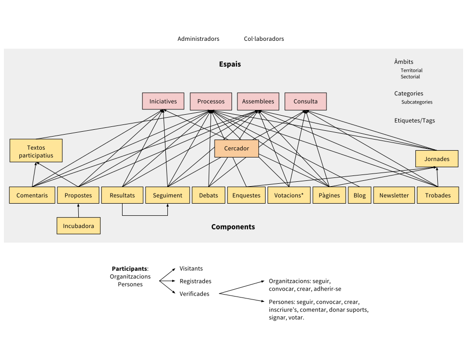

= Descripción general e introducción al funcionamiento de Decidim

Decidim [http://decidim.org], del catalán "decidimos", es una infraestructura digital para la democracia participativa construida enteramente en software libre de manera colaborativa. Más concretamente Decidim es un entorno web (un _framework_) hecho en _Ruby on Rails_ que permite crear y configurar un portal o plataforma web, a modo de una red social, para la participación democrática. El portal permite a cualquier organización (un ayuntamiento, una asociación, universidad, ONG, sindicato, barrio o cooperativa) crear procesos masivos de planificación, de presupuestos participativos, de diseño colaborativo de reglamentos, espacios urbanos o elecciones. También permite organizar reuniones presenciales, convocar encuentros, inscripciones, publicación de actas, estructurar órganos de gobiernos o asambleas, convocar consultas o canalizar iniciativas.

Para comprender en detalle el funcionamiento de Decidim, es necesario hacer una diferenciación entre _espacios_ y _componentes_ de participación (ver Figura 1).

* *Espacios de participación.* Es el marco que define la forma en la que la participación va a llevarse a cabo, los _canales_ o medios por los que la ciudadanía o los miembros de una organización pueden tramitar demandas o articular propuestas y tomar decisiones. Son espacios de participación las _Iniciativas_, los _Procesos_, las _Asambleas_ y las _Consultas_. Ejemplos concretos de cada uno de ellos son: una iniciativa ciudadana para cambiar directamente un reglamento (_Iniciativa_), la asamblea general o un consejo de trabajadores (_Asamblea_), unos presupuestos participativos, un proceso electoral o un proceso de planificación estratégica (_Procesos_), un referéndum o una llamada a votar Si o No a una propuesta concreta (_Consulta_).
* *Componentes de participación.* Son los _mecanismos_ de participación que permiten la interacción entre las personas usuarias de la plataforma y cada uno de los espacios de participación. Los componentes de participación son: _encuentros, jornadas, incubadora, propuestas, textos participativos, encuestas, debates, resultados, seguimiento, votaciones, páginas, blog, comentarios, boletín_ y _buscador_.

Las personas usuarias de la plataforma (participantes) interactúan a través de los mecanismos de participación llamados _componentes_ que ofrecen funcionalidades específicas para diferentes _espacios_ de participación. Dicho de otro modo, los _espacios_ de participación como las _Iniciativas_, las _Asambleas_, los _Procesos_ o las _Consultas_ disponen de componentes que se combinan entre sí como mecanismos de participación. Entre los componentes más destacados están los _encuentros presenciales_, las _encuestas_, las _propuestas_, las _votaciones,_ el _seguimiento de resultados_ y los _comentarios_. Así, por ejemplo, un proceso de participación específico (como la elaboración de presupuestos participativos) puede combinar, en sus diferentes fases, la posibilidad de convocar y registrar los resultados de encuentros presenciales con la ciudadanía, puede incluir una encuesta, también la posibilidad de hacer propuestas, después de un periodo de comentarios y debates, activar el componente de votación para decidir sobre los proyectos un sistema de gasto del presupuesto, después activar una encuesta de evaluación y finalmente activar el componente de seguimiento de la ejecución de los proyectos escogidos.

._Diagrama resumido de Decidim como combinación de componentes en instancias de espacios de participación. El componente Votaciones* permite diferentes sistemas de voto, expresión de apoyo o adhesión a una propuesta._

El espacio de *Procesos* permite crear, activar/desactivar y administrar diferentes procesos de participación, articularlos en diferentes fases en las que pueden combinarse todos los componentes. El espacio de *Asambleas* ofrece la posibilidad de definir órganos o grupos que se reúnen periódicamente, detallar su composición, listar y geolocalizar sus encuentros y participar en ellos (acudiendo si el aforo y la naturaleza de la asamblea lo permite, introduciendo puntos en el orden del día o comentando las propuestas y decisiones tomadas por dicho órgano). El espacio de *Iniciativas* permite crear iniciativas de manera colaborativa, definir su trayectoria u objetivo, recoger apoyos, debatir y difundir la iniciativa y definir puntos de encuentro para la recogida de firmas presenciales. El espacio de *Consultas* posibilita articular referéndums, generar debates, conectar con un sistema de voto electrónico seguro y mostrar los resultados.

En relación a los componentes, el componente *incubadora* de propuestas facilita realizar colaborativamente propuestas y hacer un seguimiento y control de los cambios. El componente *propuestas* permite crear oficialmente una propuesta, geolocalizarla, adjuntar documentos, así como navegar y filtrar propuestas. El componente *resultados* sirve para convertir propuestas en resultados y dar respuestas oficiales a su aceptación o rechazo. El componente *seguimiento* ofrece la posibilidad de subdividir resultados en proyectos, definir y aplicar estados de progreso en su ejecución y visualizar el grado de ejecución de los resultados. El componente *encuestas* facilita diseñar encuestas, publicarlas y visualizar y descargar los resultados. El componente *comentarios* permite realizar comentarios anidados, votarlos, responder y notificar las respuestas. El componente *textos participativos* permite dividir un documento de texto en propuestas o resultados e, inversamente, componer y visualizar un texto unificado en base a una colección de propuestas o resultados. El componente *votaciones* ofrece la posibilidad de activar diferentes sistemas de voto sobre las propuestas: voto directo ilimitado, limitado, ponderado, basado en costes, etc. El componente *páginas* sirve para crear páginas informativas con texto enriquecido, imágenes y vídeos. El componente *blog* permite crear, categorizar y mostrar cronológicamente noticias. El componente de *encuentros presenciales* ofrece la posibilidad de convocar, definir lugar y hora, realizar la inscripción y el control de asistencia, definir la estructura y los contenidos de una cita o encuentro presencial, así como de publicar las actas, propuestas o resultados de la misma. El componente *jornadas* permite crear una web de unas jornadas unificando un conjunto de pequeñas citas presenciales (charlas, talleres, etc.), componer un programa y gestionar la asistencia. El componente *newsletter* o boletín sirve para enviar correos electrónicos a todas las personas registradas en la plataforma o, de manera selectiva, a aquellas que participen en un espacio determinado.footnote:[No todos los componentes funcionales aquí descritos corresponden uno a uno con componentes de la arquitectura de Decidim. Por ejemplo, a día de hoy, no existe el componente de votaciones como tal, las votaciones son una propiedad del componente propuestas que se activa o desactiva desde el panel de administración. Lo mismo sucede con el componente resultados y el componente seguimiento-de-resultados. Hemos optado por realizar una distinción funcional de componente ya que la arquitectura de decidim puede variar a este respecto en el transcurso de los próximos meses.]

En cuanto a las personas participantes, existen tres categorías diferentes:

* *Persona visitante.* Puede ver: acceder a todo el contenido de la plataforma sin tener que registrarse.
* *Persona registrada.* Puede contribuir: creando un nombre de persona usuaria, contraseña y cuenta de correo electrónico (o de diferentes redes sociales). Puede realizar comentarios, crear propuestas, enviar mensajes y seguir a participantes o elementos de la plataforma y recibir notificaciones.
* *Persona verificada*. Corresponde a un nivel superior de participación. La persona puede acreditarse como miembro de una organización, ciudadana de un municipio, o perteneciente a una comunidad de decisión (una asociación, comunidad, colectivo, etc.), y una vez verificada puede inscribirse en encuentros presenciales, apoyar propuestas, firmar iniciativas y votar en consultas.

Es posible inscribirse a título *personal* o *colectivo* (asociaciones, entidades,…) y pueden crearse grupos de usuarios que se expresen de manera colectiva o individual. Las personas o colectivos participantes tienen pueden configurar/cambiar sus preferencias sobre las notificaciones.

Cada instancia de un espacio de participación (p.ej.: un proceso de participación) se sitúa dentro de un *ámbito* (territorial y/o sectorial) y se define por una serie de *categorías* y subcategorías (p.ej.: temáticas) que afectan sólo a dicho espacio. También es posible utilizar *etiquetas* y hacer uso de un buscador general o específico dentro de los diferentes espacios.

A diferencia de otras plataformas existentes, la arquitectura de Decidim es** modular,** *escalable*, fácilmente *configurable* e *integrable* con otras herramientas o aplicaciones (analítica de datos, mapas, etc.). La plataforma ha sido diseñada para facilitar la configuración y despliegue de procesos, asambleas y mecanismos participativos desde un panel de administración de una manera sencilla, no hace falta saber programar para instalarla, configurarla y activarla. Los módulos (componentes de participación) que la integran son independientes entre sí y pueden ser desarrollados, activados y desactivados de manera independiente.

A continuación hacemos una lista detallada de las funcionalidades de Decidim, y las fechas en las que están previstos los evolutivos, mejoras y nuevas funcionalidades (objeto de contratación pública en proceso durante 2017-2018). Las fechas son orientativas y se indican con el año y cuartil en el que está prevista la funcionalidad. Así, por ejemplo, "2018Q1" significa el primer cuartil (trimestre) de 2018, es decir, su funcionalidad está prevista para enero, febrero o marzo de 2018. Si una funcionalidad no tiene una fecha contractual definida pero se encuentra en periodo que abarca más de un cuartil se expresará del siguiente modo: “2018Q1-3” indicando que la funcionalidad estará disponible en algún momento entre el trimestre primero y tercero de 2018. También se indica la institución que financia y contrata las nuevas funcionalidades: AjB (Ajuntament de Barcelona) y GenCat (Generalitat de Catalunya). Las especificaciones, (tipo Lote1, etc.) después de la institución financiadora, hacen referencia a los lotes y módulos del funcional del contrato público.footnote:[Los pliegos de prescripciones técnicas en los que se detallan las nuevas funcionalidades de decidim se pueden encontrar y descargar en: https://contractaciopublica.gencat.cat/ecofin_pscp/AppJava/ca_ES/notice.pscp?idDoc=24253271&reqCode=viewCn]
